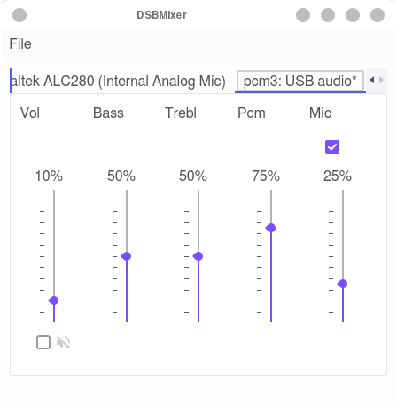
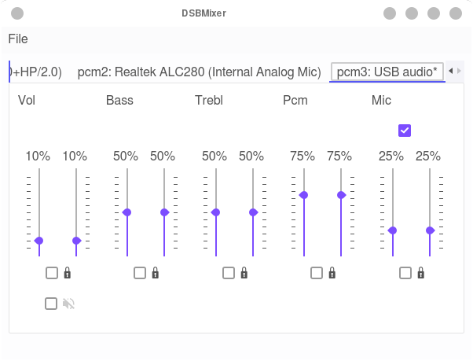
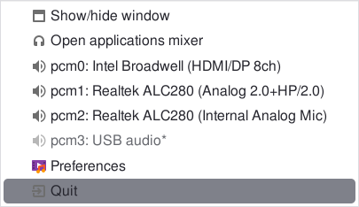
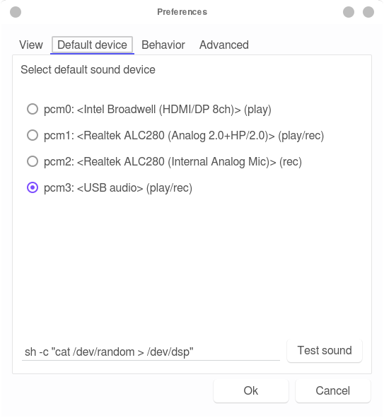
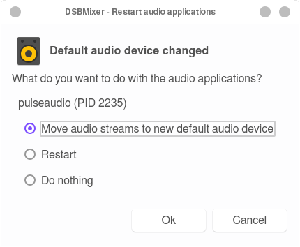
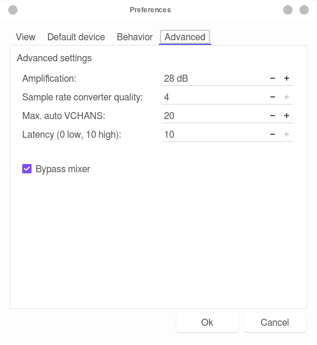

:toc:
:toc-position: preamble
:toclevels: 4
ifdef::env-github[]
:tip-caption: :bulb:
:note-caption: :information_source:
:important-caption: :heavy_exclamation_mark:
:caution-caption: :fire:
:warning-caption: :warning:
endif::[]

= DSBMixer - a tabbed Qt mixer application for FreeBSD

toc::[]

== About

_DSBMixer_ is a tabbed Qt mixer for FreeBSD. For each installed mixer
device, _DSBMixer_ opens a tab. It allows you to configure various
sound settings, such as amplification, recording sources, or the default
audio device. If built with _devd_ support, tabs are created/removed
automatically when a (USB) sound card was added to/removed from the system.

== Installation

=== Building from Source

==== Dependencies (Qt5)
* https://www.freshports.org/devel/cmake[devel/cmake]
* https://freshports.org/devel/qt5-buildtools[devel/qt5-buildtools]
* https://freshports.org/devel/qt5-core[devel/qt5-core]
* https://freshports.org/devel/qt5-linguisttools[devel/qt5-linguisttools]
* https://freshports.org/devel/qt5-qmake[devel/qt5-qmake]
* https://freshports.org/x11-toolkits/qt5-gui[x11-toolkits/qt5-gui]
* https://freshports.org/x11-toolkits/qt5-widgets[x11-toolkits/qt5-widgets]
* https://www.freshports.org/devel/kf5-knotifications/[devel/kf5-knotifications]

==== Dependencies (Qt6)
* https://www.freshports.org/devel/cmake[devel/cmake]
* https://www.freshports.org/devel/qt6-base[devel/qt6-base]
* https://www.freshports.org/devel/qt6-tools/[devel/qt6-tools]
* https://www.freshports.org/devel/kf6-knotifications/[devel/kf6-knotifications]

==== Getting the Source Code

[source,sh]
----
# git clone https://github.com/mrclksr/DSBMixer.git
# git clone https://github.com/mrclksr/dsbcfg.git
----

==== Building and Installing from Source (Qt5)

[source,sh]
----
# cd DSBMixer
# cmake -S . -B build
# cmake --build build
# cmake --build build -t install
----

==== Building and Installing from Source (Qt6)

[source,sh]
----
# cd DSBMixer
# cmake -D USE_QT6=ON -S . -B build
# cmake --build build
# cmake --build build -t install
----

Add the option `-D WITHOUT_DEVD=ON` to the first _cmake_ command if you
don't want _devd_ support.

=== Installing via _pkg(8)_

[source,sh]
----
# pkg install dsbmixer
----

=== Installing from the FreeBSD Ports

[source,sh]
----
# cd /usr/ports/audio/dsbmixer
# make install distclean
----

== Usage

=== The Main Window

The main window consists of zero or more tabs, one for each installed
sound card. You can switch between tabs by pressing *Alt*+*n*
(*n* = 1, 2, ..., 9. *n* = 0 for the last tab). The master volume (_Vol_)
of the active tab is indicated by the <<tray-icon,tray icon>>.

.Main window

[[uniview]]
==== Uni-Channel View

By default, _DSBMixer_ uses a single slider for each mixer device. Its
value is the mean of both channels. If you increase the value by _n_,
each channel is increase by a number ≤ _n_, such that its value is ≤ 100.

.Increasing left and right channel values
[EXAMPLE]
====
_left channel_ = 97,
_right channel_ = 98.
After increasing the value by 3, _left channel_ is 100,
and _right channel_ is 100.
====

.Increasing left and right channel values
[EXAMPLE]
====
_left channel_ = 42,
_right channel_ = 12.
After increasing the value by 3, _left channel_ is 45,
and _right channel_ is 15
====

.Increasing left and right channel values
[EXAMPLE]
====
_left channel_ = 100,
_right channel_ = 12.
After increasing the value by 3, _left channel_ remains 100,
and _right channel_ is 15
====

Decreasing the channel value works accordingly.

[[lrview]]
==== Left and Right Channel View

Open the _Preferences_ window under _File_ -> _Preferences_, and enable
_Show left and right channel_ in the _View_ tab, and click _Ok_.

.Left and Right Channel View

This view allows you to separately change the left and right channel. If
you check the lock symbol between them, both channel values are equally
increased (decreased) if one of them is increased (decreased). That is,
their difference is constant.

==== Adding and Removing Recording Sources

Mixer devices capable of recording are indicated by a microphone icon
and a checkbox above the slider. The checkbox lets you add (remove) the
mixer device to (from) the set of recording sources.

[NOTE]
====
Usually, you can not remove all recording sources. There must be at least one.
====

[[tray-icon]]
=== The Tray Icon

The tray icon indicates the master volume (_Vol_) of the active device tab.
The icon shows four states

* muted
* low
* medium
* high

Hovering over the tray icon will open a tool tip which shows the current
master volume in percent. If not
<<lrview, configured to show the left and right channel>> separately,
the displayed volume is the mean of both channels.
The master volume can be increased/decreased by scrolling up/down on the
tray icon. If possible, both channel volumes are
<<uniview,equally increase/decreased>>.

Left-clicking on the tray icon will show/hide the main window.

Right-clicking will show the tray icon's context menu.

.Tray icon context menu

If you click on one of the listed devices, it will become the active device.
That is, scrolling on the tray icon will change this device's master volume.
The active device is greyed out in the menu. The asterisk (`*`) marks the
default device.

==== Tray Icon Theme

You can change the icon theme for the tray icon under
_File_ -> _Preferences_ -> _View_

[[prefs-win]]
=== The Preferences Window

You can open the _Preferences_ by _File_ -> _Preferences_

==== Default Device Tab

The _Default device_ tab allows you to set the default audio device.
This is the device where applications send their audio data to if not
configured otherwise. If you press the _Test sound_ button, the command
besides is executed. By default, this sends random bytes from `/dev/random`
to the selected sound card which produces some nasty white noise. If you
can hear it, press _Ok_ to make the selected sound card the default.

[TIP]
====
You can change the test command to something that plays an audio file.
Clicking on _Ok_ makes this the default test command.
====

.Changing the default audio device

[NOTE]
====
Audio applications must be restarted to use the new default device.
====

[TIP]
====
When the default audio device was changed either through _DSBMixer_ or
other means, _DSBMixer_ can restart sound daemons like _sndiod_ and
_pulseaudio_ for you.
====

.Restarting the _pulseaudio_ daemon via _DSBMixer_

==== The Advanced Settings Tab

The _Advanced_ tab allows you to configure various sound settings.

.Advanced sound settings

Amplification:: Lower values mean more amplification, but can
		produce sound clipping when chosen too low.
		Higher values mean finer volume control.

Sample rate converter quality::
		Higher values mean better sample rate conversion,
		but more memory and CPU usage.

Max. auto VCHANS::
		Defines the max. number of virtual playback
		and recording channels that can be created.
		Virtual channels allow programs to use more playback
		and recording channels than the physical hardware
		provides.

Latency (0 low, 10 high)::
		Higher values mean better sample rate conversion,
		but more memory and CPU usage.

Bypass mixer::
		Enable this to allow applications to use
		their own existing mixer logic to control
		their own channel volume.

=== The Applications Mixer

The applications mixer allows you to control the volume of each application
currently using the sound system.

.Applications Mixer

=== The D-Bus Interface

*DSBMixer* registers the D-Bus service *org.dsb.dsbmixer*. The interface
*org.dsb.dsbmixer* under the path */* provides the following methods:

VOID org.dsb.dsbmixer.setVol(UINT32 lvol, UINT32 rvol)::
	Sets the left and right volume of the master channel.

VOID org.dsb.dsbmixer.incVol(UINT32 amount)::
	Increases the volume of the master channel by *amount*.

VOID org.dsb.dsbmixer.decVol(UINT32 amount)::
	Decreases the volume of the master channel by *amount*.

VOID org.dsb.dsbmixer.mute(BOOLEAN on)::
	Mutes the master channel if *on* is *true*. Unmutes the master channel
	if *on* is *false*.

VOID org.dsb.dsbmixer.toggleMute()::
	Toggles the mute state of the master channel.

VOID org.dsb.dsbmixer.toggleAppsWin()::
	Toggles the visibility of the applications mixer.

=== Command-line

==== Usage

*dsbmixer* [*-i*]

==== Options

-i:: Start _DSBMixer_ as tray icon

== Development

=== Contributing Translations

==== Available Translations

* French (incomplete)
* German
* Swedish (incomplete)

==== Instructions
Let's say you want to add French translations, you can proceed as follows:

. Create a fork of this repo, and clone it:
+
[source,sh]
----
% git clone url-of-your-fork
----
. Install https://www.freshports.org/devel/qt5-linguist[devel/qt5-linguist]
. `cd` to `your-forked-dsbmixer-dir`
. Add `locale/dsbmixer_fr.ts` to the `TS_FILES` list in `CMakeLists.txt`.
. In order to create the `dsbmixer_fr.ts` file, run
+
.Qt5
[source,sh]
----
% cd your-fork
% cmake -S . -B build
% cmake --build build
----
+
or
+
.Qt6
[source,sh]
----
% cd your-fork
% cmake -D USE_QT6=ON -S . -B build
% cmake --build build -t dsbmixer_lupdate
----
. Run `linguist locale/dsbmixer_fr.ts`
. Add the file to the repo: `git add locale/dsbmixer_fr.ts`
. Commit: `git commit -am 'Add French translations.'`
. Send a pull request.

== Configuring the Look and Behavior of Qt5 Applications

If you are not using KDE or GNOME, there are two ways to control the
appearance of Qt5 applications:

* <<kvantum,qt5ct and the Kvantum theme engine>>
* <<qt5-style-plugins,Qt5-style-plugins>>

[[kvantum]]
=== qt5ct and the Kvantum Theme Engine

==== qt5ct

https://freshports.org/misc/qt5ct[_qt5ct_] is a tool that allows you to
configure themes, fonts, and icons of Qt5 applications.
It can be installed via `pkg`

[source,sh]
----
# pkg install qt5ct
----

or via the FreeBSD ports:

[source,sh]
----
# cd /usr/ports/misc/qt5ct
# make install
----

In order to make Qt5 applications use _qt5ct_, add the line
`export QT_QPA_PLATFORMTHEME=qt5ct` to one of the following files, depending
on how you start your X session:

[[session_files]]
.Session Files
[options="header,footer"]
|==================================================
|X Session Start Method           |File
|_SliM_, _startx_, _xinit_        |`~/.xinitrc`
|_GDM_, _LightDM_, _LXDM_, _SDDM_ |`~/.xprofile`
|_WDM_, _XDM_                     |`~/.xsession`
|==================================================

Alternatively, you can add the line to your window manager's startup
script, or, if you are using a Bourne shell compatible login shell, to
your `~/.profile`.

After loggin out and in again, proceed with the next section.

==== Kvantum

https://www.freshports.org/x11-themes/Kvantum[_Kvantum_] is a SVG-based theme
engine for Qt, KDE and LXQt. Install it via `pkg`:

[source, sh]
----
# pkg install Kvantum-qt5
----

or via the FreeBSD ports:

[source,sh]
----
# cd /usr/ports/x11-themes/Kvantum
# make install distclean
----

Start `qt5ct` and choose *_kvantum_* under *_Appeareance_* -> *_Style_*, and
press _Ok_.

[TIP]
====
You can use _Kvantum_ directly without _qt5ct_ by setting
`QT_STYLE_OVERRIDE=kvantum`. Note, however, that the _Kvantum Manager_
lacks the ability to change fonts and the icon theme.
====

Now you can start `kvantummanager` to set, install and configure themes.

[TIP]
====
You can download
link:https://store.kde.org/browse/cat/123/order/latest[Kvantum themes]
from https://store.kde.org[KDE Store]. Unpack them, and use the
_Kvantum Manager_ to install new themes.
====

[[qt5-style-plugins]]
=== Qt5-style-plugins

https://www.freshports.org/x11-themes/qt5-style-plugins/[Qt5-style-plugins]
is a theme engine which allows using GTK-2 themes with Qt5 applications.
Install it via `pkg`

[source,sh]
----
# pkg install qt5-style-plugins
----

or via the FreeBSD ports

[source,sh]
----
# cd /usr/ports/x11-themes/qt5-style-plugins
# make install distclean
----

In order to make Qt5 applications use qt5-style-plugins, add the line
`export QT_QPA_PLATFORMTHEME=gtk2` to one of the following files, depending
on how you start your X session:

.Session Files
[options="header,footer"]
|==================================================
|X Session Start Method           |File
|_SliM_, _startx_, _xinit_        |`~/.xinitrc`
|_GDM_, _LightDM_, _LXDM_, _SDDM_ |`~/.xprofile`
|_WDM_, _XDM_                     |`~/.xsession`
|==================================================

Alternatively, you can add the line to your window manager's startup
script, or, if you are using a Bourne shell compatible login shell, to
your `~/.profile`.

After loggin out and in again, your Qt5 applications should look like your
GTK applications.
